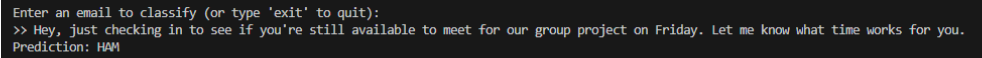

# Spam Email Classifier

A simple Python project that uses a Naive Bayes model with TF-IDF to classify emails as **spam** or **ham**.

---

## Tools
- Python 3
- pandas
- scikit-learn

---

## Setup

Install dependencies with:

```bash
pip install pandas scikit-learn
```

---

## Dataset

Using the [Enron Spam Dataset](https://github.com/MWiechmann/enron_spam_data).  
Place `emails.csv` in a `data/` folder:

```
/data/emails.csv
```

---

## Run the Program

```bash
python spam_classifier.py
```

After training, enter custom messages to test:
```
>> claim your prize now!
Prediction: SPAM

>> hey, how's it going?
Prediction: HAM
```

---

## Example Output

Below is an example of the model after training and classifying two sample emails:





## Notes

- TF-IDF improves accuracy by downweighting common words.
- Accuracy ~98%, confusion matrix + classification report included.

---

##  Project Structure

```
/Spamclassifier/
│
├── spam_classifier.py   # Main script: loads data, trains model, runs predictions
├── /data/
│   └── emails.csv       # Dataset file (not included in GitHub)
└── README.md            # Project overview and setup instructions
```
